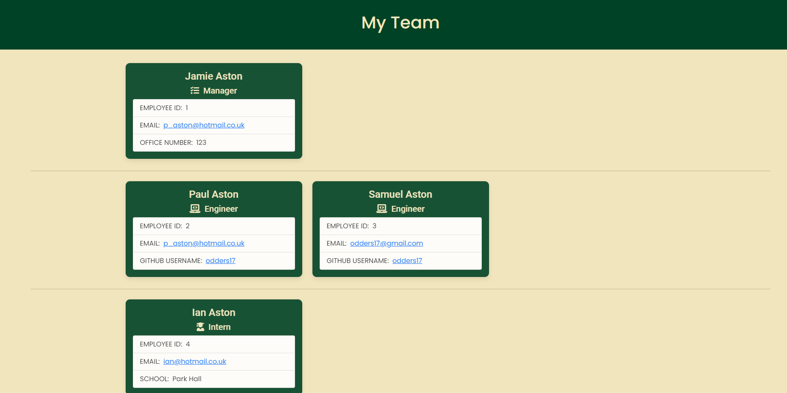

# Team-Profile-Generator

## Description

My task is to build a Node.js command-line application that takes in information about employees on a software engineering team, then generates an HTML webpage that displays summaries for each person. Testing is key to making code maintainable, so I also wrote a unit test for every part of your code and ensure that it passes each test.

## Motivation

To allow the developer more time problem solving and less time duplicating efforts, streamlining each step of the programming process it vital. One step in streamlining project development is by automating the process of creating README.md files.

## Learning Targets

This exercise was my first experience at writing tests.

# Table of Contents

*Core Objectives Met
*Technologies Used
*Installation
*Usage

## Core Objectives Met

* GIVEN a command-line application that accepts user input
* WHEN I am prompted for my team members and their information
* THEN an HTML file is generated that displays a nicely formatted team roster based on user input
* WHEN I click on an email address in the HTML
* THEN my default email program opens and populates the TO field of the email with the address
* WHEN I click on the GitHub username
* THEN that GitHub profile opens in a new tab
* WHEN I start the application
* THEN I am prompted to enter the team manager’s name, employee ID, email address, and office number
* WHEN I enter the team manager’s name, employee ID, email address, and office number
* THEN I am presented with a menu with the option to add an engineer or an intern or to finish building my team
* WHEN I select the engineer option
* THEN I am prompted to enter the engineer’s name, ID, email, and GitHub username, and I am taken back to the menu
* WHEN I select the intern option
* THEN I am prompted to enter the intern’s name, ID, email, and school, and I am taken back to the menu
* WHEN I decide to finish building my team
* THEN I exit the application, and the HTML is generated

## Technologies Used

* JavaScript
* Node.js
* Shields.io
* Jestjs.io
* NPM Inquirer Package
* NPM FS Package

## Installation

* Clone this Team-Profile-Generator repo to your machine.
* Open the repo in your terminal.
* Run npm init
* Run npm install

## Usage

* Open Team-Profile-Generator (now stored on your machine) in your terminal.
* Run node index.js
* You will be prompted to answer questions about your team. Answer each question.
* Your My-Team.html file will write to the output folder.

## Link To Live Page

https://odders17.github.io/Team-Profile-Generator/

## Link To Screencastify Video

https://drive.google.com/file/d/1gvOSpePjsPvLsD7KUIsAIgFPbvEtEw6D/view

